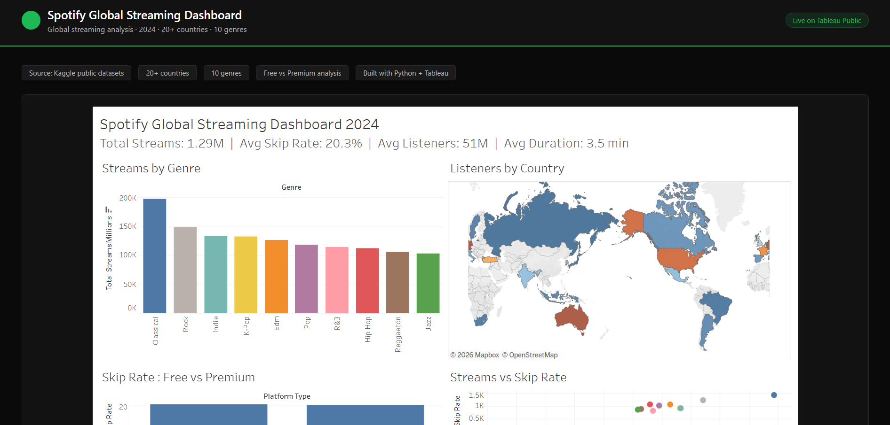

# Spotify Global Streaming Dashboard 2024

**Live Dashboard →** [View on GitHub Pages](https://gunjanagr.github.io/Spotify-Dashboard-/)  
**Tableau Public →** [View on Tableau](https://public.tableau.com/app/profile/gunjan.agarwal7499/viz/SpotifyGlobalStreamingDashboard2024/Dashboard1)

---

## What this project answers

- Which genres dominate global Spotify streaming?
- Do Free vs Premium users behave differently when it comes to skipping?
- Which countries stream the most hours on Spotify?
- Is there a relationship between total streams and skip rate by genre?

---

## Dashboard Preview



---

## Tools & Technologies

| Tool | Purpose |
|------|---------|
| Python / Pandas | Data cleaning and merging |
| Kaggle API | Dataset download |
| Tableau Public | Interactive visualization |
| GitHub Pages | Free deployment |

---

## Data Sources

- [Spotify Global Streaming Data 2024](https://www.kaggle.com/datasets/atharvasoundankar/spotify-global-streaming-data-2024) — Kaggle
- 500 rows · 20+ countries · 10 genres · Free vs Premium split

---

## Key Findings

- **Classical leads streams globally** — unexpected given pop music's cultural dominance
- **Skip rate is platform-agnostic** — Free and Premium users skip at nearly identical rates (~20%), meaning skipping is driven by content preference not ads
- **South Korea, Sweden, South Africa** lead total hours streamed — strong engagement outside Western markets
- **R&B has the longest avg stream duration** — listeners stay engaged the most with R&B tracks

---

## Project Structure

```
Spotify-Dashboard/
├── docs/
│   └── index.html        ← GitHub Pages site with embedded Tableau viz
├── spotify_jupyter_pipeline.py  ← Python cleaning pipeline
├── spotify_streaming.csv        ← Cleaned dataset used in Tableau
└── README.md
```

---

## How to Run the Pipeline

```bash
# Install dependencies
pip install pandas kaggle

# Run the cleaning pipeline
python spotify_jupyter_pipeline.py

# Output: spotify_streaming.csv → ready for Tableau
```

---

## Author

**Gunjan Agarwal**  
[GitHub](https://github.com/gunjanagr) · [Tableau Public](https://public.tableau.com/app/profile/gunjan.agarwal7499)
